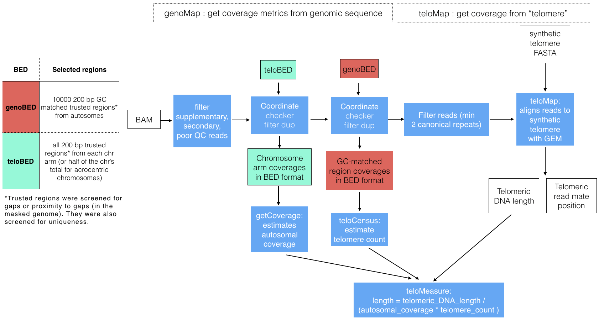
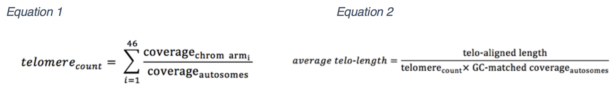

# Telomeasure

Telomeasure calculates estimated telomere length. The output includes three estimates.
The telomere_length is calculated using the number of telomeres indicated by arm level coverage and with the total alignment length after removing the percent of alignments that would be from duplicate reads based on duplication rate.
The tumor_telomere_length_46 assumes 46 telomeres.
The telomere_length_non_dedup is calculated without subtracting a fraction of telomere alignments based on duplications rate.



In most somatic cells telomere length decreases with each cycle of replication. Replicating tumor cells can escape replicative senescence triggered by critically short telomeres through either the expression of telomerase (expression of TERT) [1,2] or by homologous recombination-mediated alternative lengthening of telomeres (ALT) [3]. To investigate telomere dynamics in normal and their matching tumor cells we developed Telomeasure.

Telomeasure estimates average telomere length from whole genome sequencing (WGS) BAM files. Chromosome arm-level coverage is used to infer the number of telomeres and alignment to mock-human telomeres to estimate telomeric DNA content. Reads with one telomeric repeat (TTAGGG) are aligned with the fast and exhaustive GEM mapper [4]. Because GEM can return gapped alignments imperfect telomeric repeats can be detected. Mapping position of the telomeric read is also reported for use in identifying genomic rearrangements that relocate telomeres.

The total length of the alignment to the synthetic telomere is used with the estimated number to estimate average telomere length. Initially, base coverage is estimated for the genome (coverage<sub>autosomes</sub>) after filtering duplicate reads. Coverage is compared to chromosome arm coverage (coverage<sub>chrom_arm</sub>) to estimate the number of telomeres (telomere<sub>count</sub>) (equation 1). At the same time coverage is estimated for autosomal sequence with similar GC content to telomeres (50%) (GC-matched coverage<sub>autosomes</sub>). Putative telomeric sequence in WGS reads is identified and the length (telo-aligned length) is calculated using the GC-matched coverage<sub>autosomes</sub>. Finally, average telomere length (average telo-length) is estimated by dividing telo-aligned length by telomere<sub>count</sub> this is also divide by GC-matched coverage<sub>autosomes</sub> (equation 2).



## Dependancies
Telomeasure requires gem-mapper (v1.3), samtools (>=v.1.10), R (>= 3.0.0) with the package lattice and python2.7 
to be in the path (for `run.sh`) or in the path variables in the `telomeasure.yml` (for CWL runs).

[GEM](https://github.com/gemtools/gemtools/releases/tag/v1.3)

[Samtools](https://github.com/samtools/samtools/releases/download/1.10/samtools-1.10.tar.bz2)


## Quick start


Run Telomeasure from the commandline with shell script. This release of Telomeasure runs with build GRCh38 alignments to the human genome.
```
sample_id="sample1"
out_dir="output/dir/"
read_length=150
cram="test.cram" # cram or bam file

./run.sh \
$sample_id \
$out_dir \
$read_length \
$cram
```

Run telomeasure with CWL:

```
cwltool \
cwl/telomeasure.cwl \
cwl/telomeasure_example.yml

```

## Citations
1. Kim NW, Piatyszek MA, Prowse KR, Harley CB, West MD, Ho PL, Coviello GM, Wright WE, Weinrich SL, Shay JW, Specific association of human telomerase activity with immortal cells and cancer. Science, 1994;266(5193).
2. Shay JW and Bacchetti S. A survey of telomerase activity in human cancer. Eur J Cancer. 1997;33(5).
3. Henson JD and Reddel RR. Assaying and investigating Alternative Lengthening of Telomeres activity in human cells and cancers. FEBS Lett. 2010. 584(17).
4. Marco-Sola S, Sammeth M, Guigó R, Ribeca P. The GEM mapper: fast, accurate and versatile alignment by filtration. Nature Methods. 2012;9(12):1185–1188.

## License
This project is licensed under [BSD License 2.0](https://opensource.org/licenses/BSD-3-Clause)

Contact
Jennifer Shelton jshelton@nygenome.org, New York Genome Center

Sept 16, 2020
